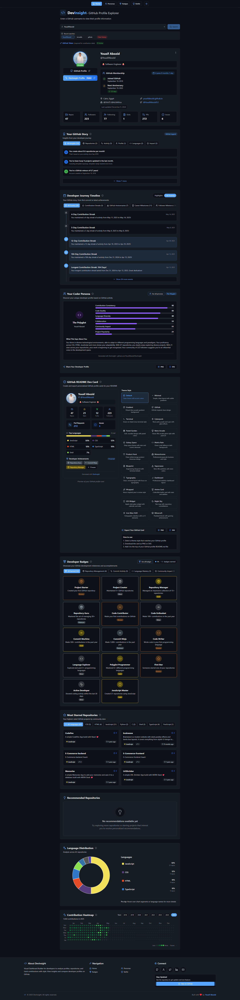
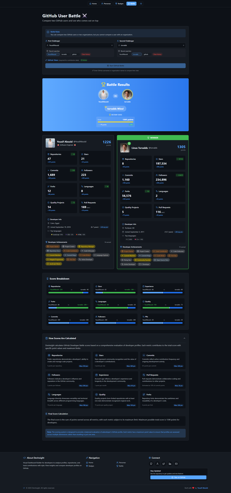

# DevInsight

<div align="center">
  
  <h3>🚀 Visual GitHub Analytics Dashboard for Developers</h3>
  <p>Transform GitHub profiles into beautiful insights with advanced visualizations and metrics</p>
  
  [](https://reactjs.org/)
  [](https://www.typescriptlang.org/)
  [](https://tailwindcss.com/)
  [](https://vitejs.dev/)
  [](https://github-dev-insight.vercel.app/)

  <div align="center">
    <table>
      <tr>
        <td align="center"><a href="#-overview"><br/>Overview</a></td>
        <td align="center"><a href="#features"><br/>Features</a></td>
        <td align="center"><a href="#live-demo"><br/>Demo</a></td>
        <td align="center"><a href="#technologies"><br/>Tech Stack</a></td>
      </tr>
      <tr>
        <td align="center"><a href="#installation"><br/>Installation</a></td>
        <td align="center"><a href="#usage"><br/>Usage</a></td>
        <td align="center"><a href="#screenshots"><br/>Screenshots</a></td>
        <td align="center"><a href="#project-structure"><br/>Structure</a></td>
      </tr>
      <tr>
        <td align="center"><a href="#contributing"><br/>Contributing</a></td>
        <td align="center"><a href="#license"><br/>License</a></td>
        <td align="center"><a href="#acknowledgments"><br/>Credits</a></td>
        <td align="center"><a href="https://github.com/YousifAbozid/DevInsight/issues"><br/>Feedback</a></td>
      </tr>
    </table>
  </div>
</div>

## ✨ Overview

DevInsight is a powerful GitHub analytics platform that transforms raw GitHub data into meaningful visualizations and actionable insights. Built with modern web technologies, it offers a comprehensive suite of tools for developers to:

- **Analyze GitHub Profiles** with detailed metrics and beautiful visualizations
- **Compare Developers** through engaging head-to-head battles
- **Generate Shareable Dev Cards** showcasing programming achievements
- **Discover Personalized Insights** about coding patterns and behaviors
- **Track Growth** through contribution heatmaps and timeline visualizations

Whether you're a developer looking to showcase your work, a hiring manager evaluating candidates, or a curious coder exploring the GitHub ecosystem, DevInsight provides a beautiful and interactive way to understand GitHub activity patterns, repository statistics, and developer behaviors in a single unified dashboard.

## Features

### 📊 Comprehensive GitHub Analytics

- **GitHub Profile Visualization**: Detailed profile statistics, repository analysis, and contribution data
- **Language Distribution Analysis**: Visualize programming language usage across repositories with interactive pie charts
- **Contribution Heatmaps**: Calendar-style visualization of GitHub activity over time
- **Developer Journey Timeline**: Track key milestones in a developer's GitHub history

### 🌟 Developer Personas & Insights

- **Coder Persona Analysis**: Identify developer strengths based on GitHub activity patterns
- **Personalized GitHub Insights**: Get customized insights about coding patterns, achievements, and milestones
- **Developer Badges**: Earn and showcase achievements based on GitHub activity

### 🎨 Customizable Dev Cards

- **Dev Card Generator**: Create beautiful, shareable cards showcasing your GitHub profile
- **Multiple Themes**: Choose from 15+ beautiful themes including GitHub, Cyberpunk, Futuristic HUD, and more
- **Export Options**: Download cards as images, share your GitHub stats

### 🥊 GitHub Battles

- **User vs. User Comparison**: Compare two GitHub users with detailed metrics
- **Organization vs. Organization**: Compare GitHub organizations
- **Comprehensive Scoring System**: Evaluate profiles based on stars, commits, repositories, followers, and more

### 🔍 Advanced Features

- **Repository Recommendations**: Get personalized repository suggestions based on profile analysis
- **Most Starred Repositories**: Quick access to a user's most popular projects
- **Rate Limit Monitoring**: Track GitHub API usage with built-in rate limit indicator
- **Profile Export**: Export GitHub profile data in multiple formats (JSON, CSV, Text)

## Live Demo

[View the live application](https://github-dev-insight.vercel.app/)

## Technologies

- **Frontend Framework**: React 19 with TypeScript
- **Routing**: React Router v7
- **Styling**: Tailwind CSS v4
- **Data Fetching**: TanStack Query (React Query)
- **Animation**: Framer Motion
- **Charts**: Chart.js with React-Chartjs-2
- **Build Tool**: Vite
- **State Management**: React Context API
- **Performance Optimization**: Query caching, image optimization, code splitting

## Installation

```bash
# Clone the repository
git clone https://github.com/YousifAbozid/DevInsight.git

# Navigate to project directory
cd DevInsight

# Install dependencies
npm install

# Start development server
npm run dev
```

## Usage

### GitHub Token (Optional)

DevInsight works without authentication, but using a GitHub token provides:

- Higher API rate limits
- Access to private repositories (if authorized)
- More detailed contribution data

To add your GitHub token:

1. Create a token at [GitHub Developer Settings](https://github.com/settings/tokens)
2. Add the token to the application's settings page
3. The token is stored securely in your browser's local storage

### Profile Analysis

1. Enter a GitHub username in the search bar
2. View detailed visualizations of the user's GitHub activity
3. Explore different sections for deeper insights

### GitHub Battles

1. Navigate to the Battle page
2. Enter two GitHub usernames or organization names
3. View the comprehensive comparison and see who comes out on top

### Dev Card Generator

1. Search for a GitHub profile
2. Navigate to the Dev Card section
3. Choose your preferred theme
4. Download or share your personalized GitHub stats card

## Screenshots

<div align="center">
  <h3>Application Overview</h3>
  <p>Full application dashboard view</p>
  
</div>

<div align="center" style="margin-top: 30px; display: flex; flex-wrap: wrap; justify-content: center; gap: 20px;">
  <div style="flex: 1; min-width: 300px; max-width: 45%;">
    <h4>GitHub Battle Comparison</h4>
    
  </div>
  <!-- <div style="flex: 1; min-width: 300px; max-width: 45%;">
    <h4>Dev Card Themes</h4>
    
  </div> -->
</div>

## Project Structure

```
.
├── src/
│   ├── components/      # UI components
│   │   ├── battle/      # GitHub Battle components
│   │   ├── shared/      # Reusable UI components
│   │   └── themes/      # Dev Card themes
│   ├── context/         # React context providers
│   ├── hooks/           # Custom React hooks
│   ├── pages/           # Application pages
│   ├── services/        # GitHub API services
│   ├── types/           # TypeScript type definitions
│   └── utils/           # Utility functions
├── public/              # Static assets
└── index.html           # HTML entry point
```

## Contributing

Contributions are welcome! Please feel free to submit a Pull Request.

1. Fork the repository
2. Create your feature branch (`git checkout -b feature/amazing-feature`)
3. Commit your changes (`git commit -m 'Add some amazing feature'`)
4. Push to the branch (`git push origin feature/amazing-feature`)
5. Open a Pull Request

## License

This project is licensed under the MIT License - see the [LICENSE](LICENSE) file for details.

## Acknowledgments

- GitHub API for providing access to developer data
- The open-source community for invaluable libraries and tools

---

<div align="center">
  <p>Made with ❤️ by <a href="https://github.com/YousifAbozid">Yousif Abozid</a></p>
</div>
